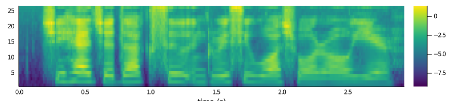

# SpeechFeatures

SpeechFeatures is a Julia package for extracting acoustic features
for speech technologies.

| **Documentation**  | **Test Status**   |
|:------------------:|:-----------------:|
| [](https://lucasondel.github.io/SpeechFeatures/stable) [](https://lucasondel.github.io/SpeechFeatures/dev) |  |

See the [changelog file](CHANGELOG.md) to check what's new since the
last release.

## Installation

```
pkg> add SpeechFeatures
```

## Example

```julia
julia> # x = ... extracted signal
julia> lms = LogMelSpectrum()
julia> x |> lms
```



Have a look at the [documentation](https://lucasondel.github.io/SpeechFeatures/stable/)
to get started.

## Authors

Lucas Ondel 2020

